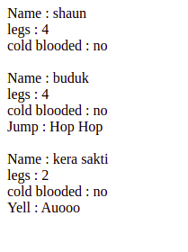

# TUGAS OOP PHP

Sebelum mengerjakan challenge ini, buatlah sebuah folder dengan nama “oop” di dalam direktori htdocs kalian. Di dalam folder oop tersebut buatlah sebuah file index.php sebagai entry dari program yang akan dibuat.

## Class Animal

Terdapat sebuah class Animal yang memiliki sebuah constructor name, default property legs = 4 dan cold_blooded = no.

## RELEASE 0

Buatlah class Animal tersebut di dalam file animal.php.Lakukan instance terhadap class Animal tersebut di file index.php. Lakukan import class Animal dari animal.php di dalam index.php menggunakan require atau require once (mengenai require bisa baca dari [artikel berikut](https://jagowebdev.com/include-include_once-require-dan-require_once-pada-php/)).

Tampilkan nama dari Animal yang baru dibuat tersebut.

```php
$sheep = new Animal("shaun");

echo $sheep->name; // "shaun"
echo $sheep->legs; // 4
echo $sheep->cold_blooded; // "no"

// NB: Boleh juga menggunakan method get (get_name(), get_legs(), get_cold_blooded())

```

## RELEEASE 1

Buatlah class Frog dan class Ape yang merupakan inheritance dari class Animal. Masing-masing class dibuat ke dalam satu file (Frog.php & Ape.php). Perhatikan bahwa Ape (Kera) merupakan hewan berkaki 2, hingga dia tidak menurunkan sifat jumlah kaki 4. class Ape memiliki function yell() yang mengeprint “Auooo” dan class Frog memiliki function jump() yang akan mengeprint “hop hop”.

```php
// index.php
$sungokong = new Ape("kera sakti");
$sungokong->yell() // "Auooo"

$kodok = new Frog("buduk");
$kodok->jump() ; // "hop hop"

```

## output


